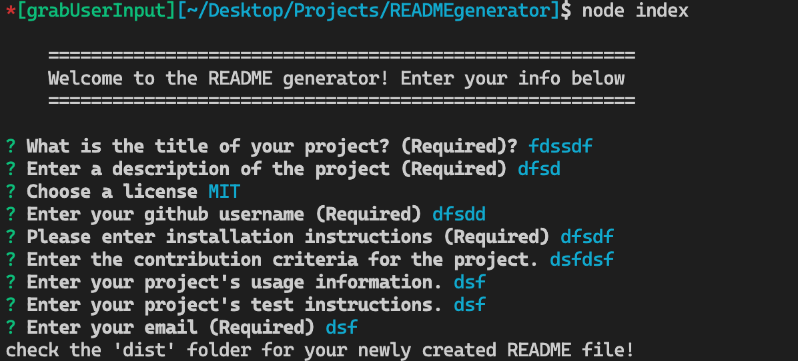

 ## **SAMPLE OF WHAT THE APPLICATION WILL GENERATE** 

   

----------------------------------------------------------
## Click the image below to display my youtube video walking through the application

 

----------------------------------------------------------

 

  # README Generator

  ## TABLE OF CONTENTS

  - [Description](#description)
  - [Installation Instructions](#installation)
  - [Contributions](#contributions)
  - [Usage](#usage)
  - [Tests](#tests)
  - [Questions](#questions)

   

  ## Description

  ### Generating a README markdown file using Node, npm, and the command line interface

   

  ## Installation

  ### To install, clone the repository to your local machine. Open the repository on your IDE editor. Open your terminal and make sure you are within the proper directory. Make sure to run 'npm init' in your terminal, then type in 'node index' to run a series of questions. 

   

  ## Contributions

  ### contribution criteria goes here

   

  ## Usage
  
  ### usage info goes here

   

  ## Tests

  ### test instructions go here

   

  ## Questions

  #### Email: abelaj7196@gmail.com
  #### Github: https://github.com/alessandroB96

  